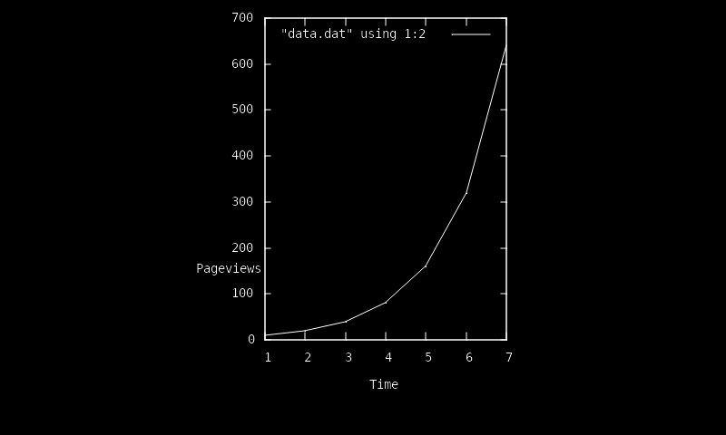

# ReGIS

The first few chapters of 
[VT330/VT340 Programmer Reference Manual Volume 2: Graphics Programming](https://vt100.net/docs/vt3xx-gp/)
are about ReGIS mode, a turtle-graphics drawing mode which was first included
in the VT300 series of terminals (up to and including the VT525).

This implementation is of course just a start, but it's enough to render
some GnuPlot output as documented for [HTerm](http://41j.com/hterm/#examples).
Modern distros tend to leave the ReGIS support out of the gnuplot package,
so you may need to compile it yourself to get that feature.  (First edit
src/term.h and make sure ```#include "regis.trm"``` is not commented out
or #if'd out.)  If you have a ReGIS-capable version of GnuPlot, then you
can run plot.sh from this directory, which will hopefully output the same
ReGIS commands as the ones in data.out.  If not, you can just
```cat data.out``` in your yat session.  Either way, it should interpret
(a few of) the commands and create /tmp/regis-out.png with the result:



Files in this directory:

* data.dat is some fake data in a form GnuPlot can understand
* data.gnuplot is a GnuPlot command file
* data.out is the output GnuPlot produces
* plot.sh is a shell script to run GnuPlot
* regis-out.png is what yat produces from the ReGIS commands

